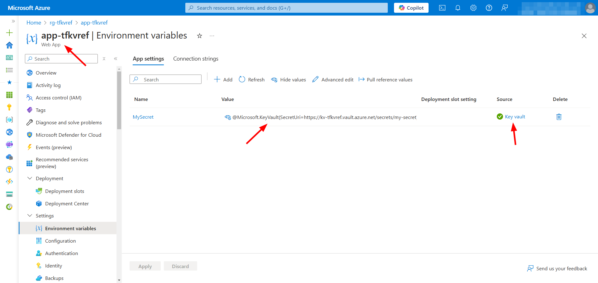

# Terraform Azure Key Vault References

A Terraform configuration that integrates Azure Key Vault references into Azure App Service application settings using a user-assigned managed identity.

This setup ensures secure and seamless access to secrets while following best practices for identity management and infrastructure as code.



Learn more: [Use Key Vault references as app settings in Azure App Service and Azure Functions](https://learn.microsoft.com/en-us/azure/app-service/app-service-key-vault-references)

## Getting Started

```bash
cp terraform.tfvars.example terraform.tfvars
terraform init
```

## Development

```bash
terraform plan -out=tfplan
terraform apply "tfplan"
```
